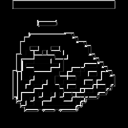

# edge_detector
A convolution based image edge detector that isn't that good, but hey! Its written in Rust!
Made based on the explanation in [3b1b's video](https://youtu.be/KuXjwB4LzSA) on convolution.

Surprisingly(?) fast when using the `cargo build --release` version.

### Help
```
Detects edges on an image using convolution

Usage: edge_detector.exe [OPTIONS]

Options:
  -i, --open-image <image>   Path to image from working directory
  -o, --save-image <output>  Path to output image from working directory, (include file ending) [default: ./processed.png]
  -h, --help                 Print help information
  -V, --version              Print version information
```

## Example
`.\edge_detector(.exe) -i "birb.png" -o "./birb_processed.png`

